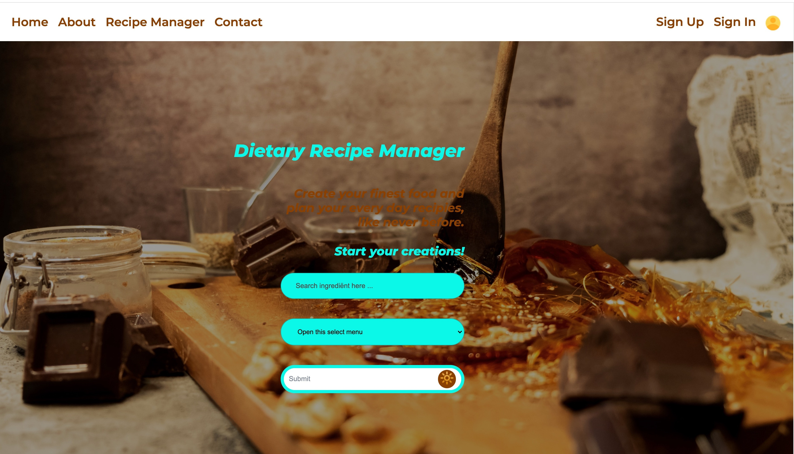

# Dietary Recipe Manager

This project was bootstrapped with [Create React App](https://github.com/facebook/create-react-app).




> Start creating your finest!


### Table of Contents
Your sections headers will be used to reference location of destination.

- [Description](#description)
- [How To Use](#built-with)
- [References](#references)
- [License](#license)
- [Author Info](#author-info)

---

## Description

Having specific dietary wishes for my meals, (No pork, only fish with scales and fins, No cow milk) I am always looking for ingredients that fit my diet. Planning my daily diner, means time-consuming, dissecting every product I use. This application will save you from all that.

This application compiles recipe(s) based upon the ingredient you put into the search field. The application also lets the user select from a list with different dietary options, (supplied by the FOOD API Edamam). By submitting your preferences, the application supplies recipe’s for your main course and presents the option to store 7 recipes in a recipe planner. The user has to be signed in to use the dietary recipe manager.

#### Technologies: Built With

- NPM
- Node
- React
- React Router V6
- Axios
- Firebase Backend
- Project editor (WebStorm)

#### Future updates

- [x] Reliable Storage // This is done
- [ ] Enhancing Sidedrawer // This is pending


[Back To The Top](#read-me-template)

---


#### API Reference

[Recipe API Edamam] ( <https://www.edamam.com> "API")


```javascript
       const createYourFinest = "A LIFE SAVER!!";
```
[Back To The Top](#read-me-template)

---

## References

~ GitHub - [ Jensch25 ] ( <https://github.com/Jensch25> )

---

[Back To The Top](#read-me-template)


## License

MIT License

Copyright (c) [2022] [Jensch25]

Permission is hereby granted, free of charge, to any person obtaining a copy
of this software and associated documentation files (the "Software"), to deal
in the Software without limitation the rights
to use, copy, modify, merge, publish, distribute, sublicense, but not to sell
copies of the Software, and not to permit persons to whom the Software is
furnished to do so, subject to the following conditions:

The above copyright notice and this permission notice shall be included in all
copies or substantial portions of the Software.

THE SOFTWARE IS PROVIDED "AS IS", WITHOUT WARRANTY OF ANY KIND, EXPRESS OR
IMPLIED, INCLUDING BUT NOT LIMITED TO THE WARRANTIES OF MERCHANTABILITY,
FITNESS FOR A PARTICULAR PURPOSE AND NONINFRINGEMENT. IN NO EVENT SHALL THE
AUTHORS OR COPYRIGHT HOLDERS BE LIABLE FOR ANY CLAIM, DAMAGES OR OTHER
LIABILITY, WHETHER IN AN ACTION OF CONTRACT, TORT OR OTHERWISE, ARISING FROM,
OUT OF OR IN CONNECTION WITH THE SOFTWARE OR THE USE OR OTHER DEALINGS IN THE
SOFTWARE.

[Back To The Top](#read-me-template)

---

## Author Info

**Jensch**

~ GitHub - [ Jensch25 ] ( <https://github.com/Jensch25> "Jensch")

[Back To The Top](#read-me-template)

## Available Scripts

In the project directory, you can run:

### `npm start`

Runs the app in the development mode.\
Open [http://localhost:3000](http://localhost:3000) to view it in your browser.

The page will reload when you make changes.\
You may also see any lint errors in the console.

### `npm test`

Launches the test runner in the interactive watch mode.\
See the section about [running tests](https://facebook.github.io/create-react-app/docs/running-tests) for more information.

### `npm run build`

Builds the app for production to the `build` folder.\
It correctly bundles React in production mode and optimizes the build for the best performance.

The build is minified and the filenames include the hashes.\
Your app is ready to be deployed!

See the section about [deployment](https://facebook.github.io/create-react-app/docs/deployment) for more information.

### `npm run eject`

**Note: this is a one-way operation. Once you `eject`, you can't go back!**

If you aren't satisfied with the build tool and configuration choices, you can `eject` at any time. This command will remove the single build dependency from your project.

Instead, it will copy all the configuration files and the transitive dependencies (webpack, Babel, ESLint, etc.) right into your project, so you have full control over them. All of the commands except `eject` will still work, but they will point to the copied scripts, so you can tweak them. At this point you're on your own.

You don't have to ever use `eject`. The curated feature set is suitable for small and middle deployments, and you shouldn't feel obligated to use this feature. However, we understand that this tool wouldn't be useful if you couldn't customize it when you are ready for it.

## Learn More

You can learn more in the [Create React App documentation](https://facebook.github.io/create-react-app/docs/getting-started).

To learn React, check out the [React documentation](https://reactjs.org/).

### Code Splitting

This section has moved here: [https://facebook.github.io/create-react-app/docs/code-splitting](https://facebook.github.io/create-react-app/docs/code-splitting)

### Analyzing the Bundle Size

This section has moved here: [https://facebook.github.io/create-react-app/docs/analyzing-the-bundle-size](https://facebook.github.io/create-react-app/docs/analyzing-the-bundle-size)

### Making a Progressive Web App

This section has moved here: [https://facebook.github.io/create-react-app/docs/making-a-progressive-web-app](https://facebook.github.io/create-react-app/docs/making-a-progressive-web-app)

### Advanced Configuration

This section has moved here: [https://facebook.github.io/create-react-app/docs/advanced-configuration](https://facebook.github.io/create-react-app/docs/advanced-configuration)

### Deployment

This section has moved here: [https://facebook.github.io/create-react-app/docs/deployment](https://facebook.github.io/create-react-app/docs/deployment)

### `npm run build` fails to minify

This section has moved here: [https://facebook.github.io/create-react-app/docs/troubleshooting#npm-run-build-fails-to-minify](https://facebook.github.io/create-react-app/docs/troubleshooting#npm-run-build-fails-to-minify)
